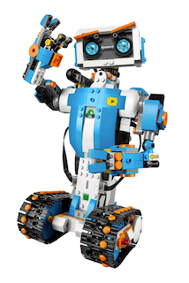
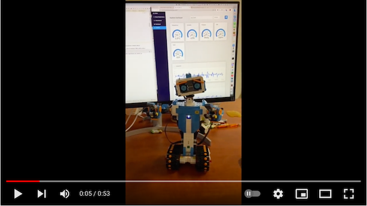
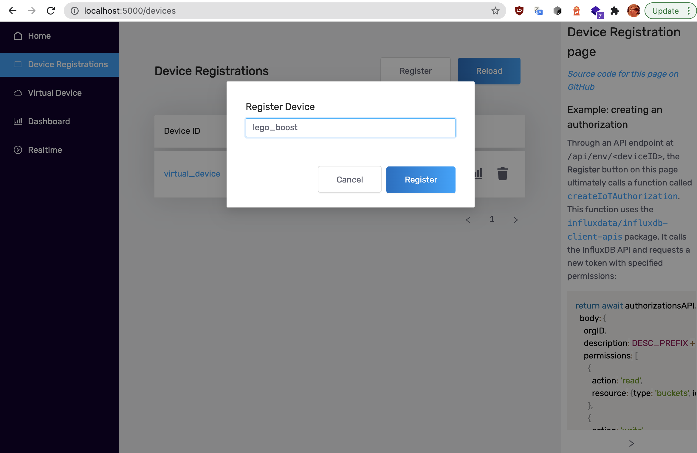
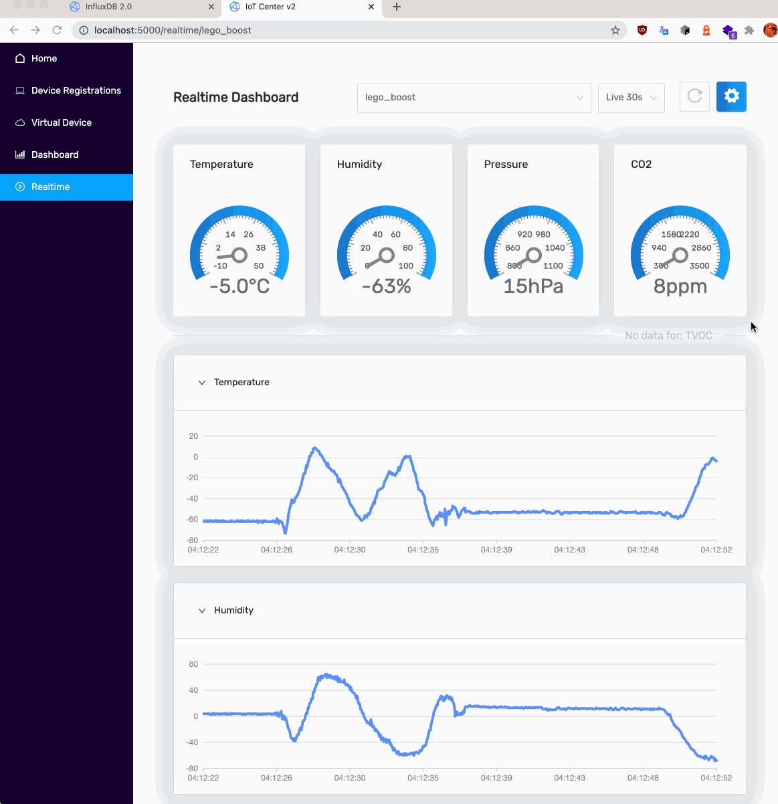

# InfluxDB & Lego Boost real-time monitoring demo

This demo shows how to monitor your Lego Boost Robot using InfluxDB, Telegraf, IoT Center Demo with MQTT realtime
dashboards.
   

  
[](https://www.youtube.com/watch?v=Cp2gDleP8_M)

## Description 

This application was designed to display and store real-time data from LEGO Boost Robot and because the application from
LEGO lacks this feature. We used InfluxDB to store the data, MQTT, Telegraf, IotCenter Demo to show realtime since it's
the fastest way to do so.

In future we want to support monitoring of all lego robots, such as Robot Inventor and EV3, so that we can then store
time series for color, ultrasonic, and infrared sensors and not just gyro sensor and motors. Our program will also
provide some calculations based on the data it monitors such as speed, acceleration, trajectory, energy consumption,
lead (for racing), health (for robot battles), work performance (for lego factories), and more.

## How to install

### IoT Center setup

After cloning this repository, you should be ready to set up our IoT Center. 

We recommend using Python Virtual Environment <https://docs.python.org/3/tutorial/venv.html>
to have a clean setup.

```bash
https://github.com/bonitoo-io/influxdb-lego.git
cd influxdb-lego

python3 -m venv venv
source venv/bin/activate

pip install -r requirements.txt
```

At first, you should download and install docker from here: https://www.docker.com/get-started. 

After that, you will need to set your real local network IP address into `EXTERNAL_IP` variable in `.env`.

To find your IP on Mac address, simply open a terminal and type:

```bash
ipconfig getifaddr en0
```

Copy to clipboard and then execute this command:

```bash
# edit .env and set 
nano .env
```
Fill your `EXTERNAL_IP` and then save it using `ctrl + x`.
All you have to do now is to start the latest version of IotCenter using `docker-compose`.

```bash
docker-compose up
```

It will take several seconds to start the IotCenter.

Note that the IoT Center requires the following free ports that do not bind:

- **1883** (mqtt broker)
- **8086** (influxdb 2.0 OSS)
- **5000**, 3000 nodejs server and UI app

### Lego Boost registration 

The next step is to register your Lego Boost robot into IotCenter. Open the IoT Center UI
on <http://localhost:5000/devices> and click **Register** to add a new device. Enter `lego_boost` as a device id and
confirm by clicking **Register**.



### Prepare Lego Boost for Bluetooth pairing

- Install Lego Boost app on iPhone or Android device and run firmware upgrade
- Ensure that Robot is working with your iOS or Android device
- Press the green
### Run Python demo

```bash
python ./boost_iot_center.py
```

On the first time, you will need to enable BlueTooth access in the MacOS security preferences dialogue popup.

Run again and **immediately press the green button on lego brick**.

The demo will autodetect your lego hub and start in 5-10s. The output should look like this:

```text
(venv) ➜  influxdb-lego git:(main) ✗ python ./boost-iot-center.py
462	INFO	root	Searching for Lego Hub...
10524	INFO	root	Connecting to Lego Hub...
10526	INFO	comms-bleak	Discovering devices... Press green button on Hub
11618	INFO	comms	Found Move Hub at BBF17DA9-7FC1-408F-B829-B58A9B8507CA
11618	INFO	comms-bleak	Device matched: BBF17DA9-7FC1-408F-B829-B58A9B8507CA: Move Hub
12390	INFO	hub	Attached peripheral: EncodedMotor on port 0x0
12402	INFO	hub	Attached peripheral: EncodedMotor on port 0x1
12413	INFO	hub	Attached peripheral: VisionSensor on port 0x2
12424	INFO	hub	Attached peripheral: EncodedMotor on port 0x3
12437	INFO	hub	Attached peripheral: EncodedMotor on port 0x10
12448	INFO	hub	Attached peripheral: LEDRGB on port 0x32
12461	INFO	hub	Attached peripheral: TiltSensor on port 0x3a
12472	INFO	hub	Attached peripheral: Current on port 0x3b
12482	INFO	hub	Attached peripheral: Voltage on port 0x3c
12495	WARNING	hub	Have no dedicated class for peripheral type 0x42 (UNKNOWN) on port 0x46
12495	INFO	hub	Attached peripheral: Peripheral on port 0x46
12723	INFO	hub	b'Move Hub' on b'001653bf6d29'
12833	INFO	hub	Voltage: 100%
12935	INFO	root	Running Demo...
13049	INFO	root	> environment,CO2Sensor=virtual_CO2Sensor,HumiditySensor=virtual_HumiditySensor,PressureSensor=virtual_PressureSensor,TVOCSensor=virtual_TVOCSensor,clientId=lego_boost TVOC=-1 1636729176045009000
13148	INFO	root	> environment,CO2Sensor=virtual_CO2Sensor,HumiditySensor=virtual_HumiditySensor,PressureSensor=virtual_PressureSensor,TVOCSensor=virtual_TVOCSensor,clientId=lego_boost TVOC=-1 1636729176145016000
13251	INFO	root	> environment,CO2Sensor=virtual_CO2Sensor,HumiditySensor=virtual_HumiditySensor,PressureSensor=virtual_PressureSensor,TVOCSensor=virtual_TVOCSensor,clientId=lego_boost rgb=3 1636729176247289000
13351	INFO	root	> environment,CO2Sensor=virtual_CO2Sensor,HumiditySensor=virtual_HumiditySensor,PressureSensor=virtual_PressureSensor,TVOCSensor=virtual_TVOCSensor,clientId=lego_boost Pressure=2 1636729176347604000
```

Lego metrics are mapped to IoT Center hardcoded weather metrics:

- Temperature -> tilt axe X
- Humidity -> tilt axe Y
- Pressure -> distance sensor
- CO2 -> battery voltage
- TVOC -> motor angle

Check IoT Center: [http://localhost:5000/realtime/lego_boost](http://localhost:5000/realtime/lego_boost)



